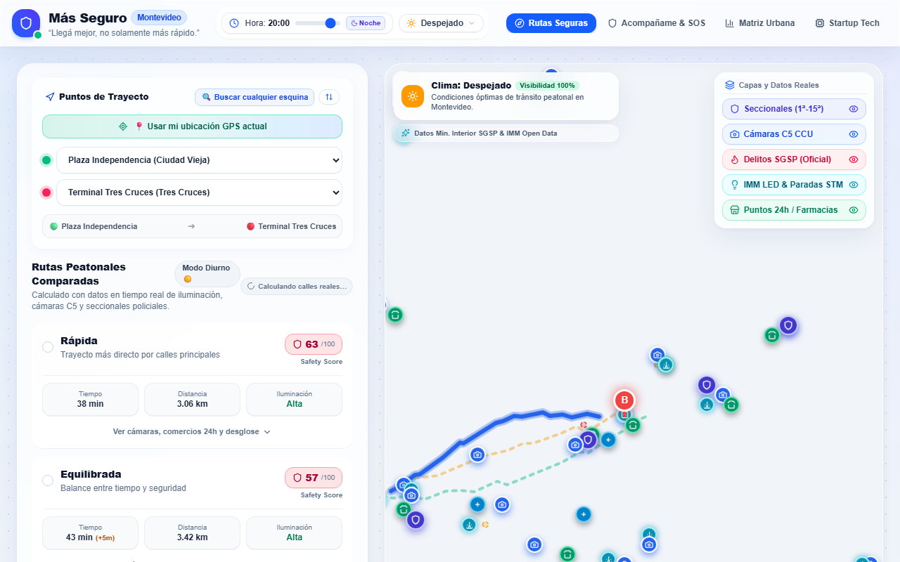

# Más Seguro — Montevideo

Navegación peatonal segura para Montevideo: Safety Score, comparación de rutas, IA predictiva y reportes ciudadanos.

**[Probar la demo en vivo](https://mas-seguro.vercel.app/)**

## 📸 Capturas

## Variables de entorno

Se configuran en *Vercel Dashboard → Settings → Environment Variables*, o en `.env.local` al correr en local (ver `.env.example`).

| Variable | Requerida | Descripción |
|---|---|---|
| `SUPABASE_URL` | Sí | URL del proyecto Supabase |
| `SUPABASE_ANON_KEY` | Sí | Anon key de Supabase |
| `GEMINI_API_KEY` | No | API key de Google Gemini (gratis en [AI Studio](https://aistudio.google.com/apikey)) |

## Correr localmente

**Requisitos:** Node.js 18+

1. Instalá las dependencias: `npm install`
2. Copiá `.env.example` a `.env.local` y completá los valores de Supabase.
3. Arrancá la app: `npm run dev`
4. Abrí http://localhost:5173

## Base de datos (Supabase)

Ejecutá el script SQL en `supabase/migrations/001_create_reports.sql` desde el SQL Editor de Supabase para crear la tabla `community_reports` con los datos iniciales.

## Arquitectura

- **Frontend**: React 19 + Vite + Tailwind CSS v4
- **Backend**: Vercel Serverless Functions (API routes en `api/`)
- **Base de datos**: Supabase (PostgreSQL)
- **Mapas**: Leaflet + CartoDB Voyager tiles
- **Routing**: OSRM Foot (gratuito, sin API key)
- **Clima**: Open-Meteo (gratuito)
- **Geocoding**: Nominatim/OpenStreetMap (gratuito)
- **IA**: Google Gemini 2.0 Flash (opcional, con fallback heurístico)

## Seguridad

- Headers de seguridad (HSTS, X-Content-Type-Options, X-Frame-Options)
- Input validation y sanitización en todos los endpoints
- Rate limiting en requests a APIs externas (Nominatim, OSRM, Open-Meteo)
- CSP compatible con Leaflet (sin inline scripts)
- Tokens y secrets nunca en el código fuente

## Licencia

MIT — ver [LICENSE](LICENSE).
